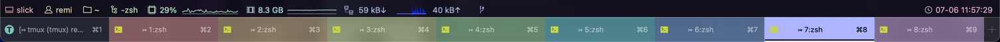
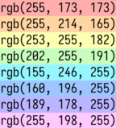
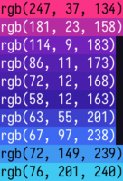

iterm2-tmux-color-tabs
======================



Plugin for Oh My Zsh to make your iTerm2 tmux tabs colourful.

## Installation

First, clone the repo:

```sh
git clone https://github.com/remino/omz-plugin-iterm2-tmux-color-tabs.git "$ZSH_CUSTOM/plugins/iterm2-tmux-color-tabs"
```

Second, add `iterm2-tmux-color-tabs` to your Oh My Zsh plugins:

```
plugins+=(iterm2-tmux-color-tabs)
```

Last, restart your shell.

Every subsequent tmux tab opened in iTerm2 will have the next colour from the default or specified palette.

## Custom Palette

You can customize the color palette by setting the `ITERM2_TMUX_COLOR_TABS` environment variable.

### Default



```sh
ITERM2_TMUX_COLOR_TABS_PALETTE=(
	"255 173 173"
	"255 214 165"
	"253 255 182"
	"202 255 191"
	"155 246 255"
	"160 196 255"
	"189 178 255"
	"255 198 255"
)
```

### Example



```sh
ITERM2_TMUX_COLOR_TABS_PALETTE=(
	"247 37 134"
	"181 23 158"
	"114 9 183"
	"86 11 173"
	"72 12 168"
	"58 12 163"
	"63 55 201"
	"67 97 238"
	"72 149 239"
	"76 201 240"
)
```

